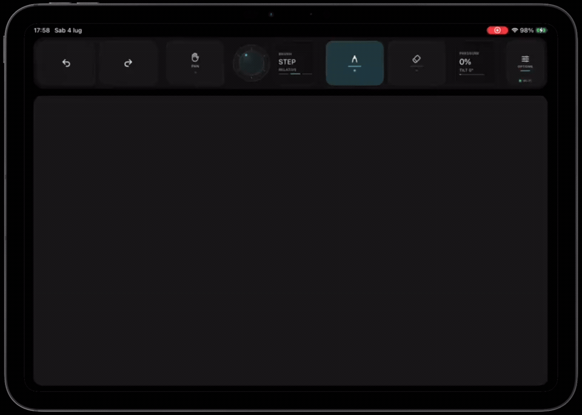

# InkWand

Use an iPad with Apple Pencil as a desktop graphics tablet.



InkWand has two parts:

- `Apps/iPad`: the iPad app, built with `xtool`.
- `Apps/Server`: the desktop tray/server app. Linux is intended for AppImage distribution; macOS is supported on macOS 15 and newer.
- `Packages/InkWandCore`: shared protocol, mapping, pairing, settings, and tests.

On Linux, the server exposes virtual pen, touch, and pad devices through `/dev/uinput`. On macOS 15+, it posts CoreGraphics tablet-point events for pen input and sends pad shortcuts with CoreGraphics. Wi-Fi discovery supports multiple iPads and multiple computers on the same network, and sessions must authenticate through a trusted pairing record before input is accepted.

## Features

- Apple Pencil input with pressure and tilt.
- Pen and eraser tool modes.
- Native Linux multitouch gestures, including two-finger pinch/zoom in apps such as Krita. macOS touch gesture injection is not implemented yet.
- Pad actions for undo, redo, brush size, opacity, and pan.
- Secure pairing model with one-time codes and persistent trusted peers.
- Global pad rebinding stored in user config.
- Optional launch-at-startup through a user autostart `.desktop` entry.

## Requirements

- Swift 6 for development builds.
- Linux with `/dev/uinput`, or macOS 15+.
- `iproxy` for USB mode.
- `avahi-publish-service` for Linux Wi-Fi discovery. macOS uses Bonjour through Foundation.
- `xtool` for installing the iPad app during development.

On Arch-like systems:

```bash
sudo pacman -S swift libimobiledevice usbmuxd avahi
sudo modprobe uinput
```

On macOS:

```bash
brew install swift libimobiledevice
```

macOS asks for input permissions the first time the server starts. Allow InkWandServer in Privacy & Security when prompted. If drawing or pad shortcuts do not work, check System Settings > Privacy & Security > Accessibility and Input Monitoring, then reopen the server.

InkWand is designed to run as a user-launched AppImage. A distro may still need a one-time udev rule or equivalent local setup to allow the user to access `/dev/uinput`; the app itself does not install a systemd daemon.

## Build

```bash
swift test --package-path Packages/InkWandCore
swift build --package-path Apps/Server -c release --product InkWandServer
cd Apps/iPad
xtool dev run
```

Swift Bundler metadata is defined in `Apps/Server/Bundler.toml`:

```bash
cd Apps/Server
swift bundler bundle InkWandServer
```

For SwiftCrossUI hot reload, run the app through Swift Bundler instead of
`swift run`. Swift Bundler starts the hot reload server and passes
`SWIFT_BUNDLER_SERVER` to the app:

```bash
cd Apps/Server
swift bundler run InkWandServer --hot
```

If Swift Bundler is only available as a package plugin, use:

```bash
cd Apps/Server
swift package plugin --allow-writing-to-package-directory bundler run InkWandServer --hot
```

If Swift Bundler does not emit an AppImage directly in your Linux environment, use its bundle output as the AppDir input for AppImage tooling.

## Run

During development:

```bash
Apps/Server/.build/release/InkWandServer
```

By default the server:

- creates `InkWand Virtual Pen`
- creates `InkWand Touch Surface`
- creates `InkWand Pad`
- listens for Wi-Fi on port `24817`
- publishes `_inkwand._tcp`
- answers UDP discovery with server identity and pairing availability
- rejects input until the iPad authenticates

Server settings, pairing approvals, trusted iPads, launch-at-startup, and quit are controlled from the settings window and tray/status icon.

## Wi-Fi Firewall

Wi-Fi needs TCP and UDP port `24817`.

If your Linux firewall blocks local discovery or connections, open TCP and UDP port `24817` with your system firewall tool.

## Launch At Startup

On Linux, the AppImage product should implement “Launch when system starts” by writing:

```text
~/.config/autostart/inkwand.desktop
```

The entry points to the current AppImage path. If the AppImage is moved, InkWand detects the stale path and asks the user to re-enable launch at startup.

Deleting the AppImage removes the application. User config and optional autostart files remain under standard XDG locations and can be removed from settings.

## iPad App

The app discovers computers on the local network and stores trusted servers independently, so one iPad can be paired with multiple computers and reconnect only to the selected one.

Connection modes:

- `Auto`: use USB when available, otherwise Wi-Fi.
- `USB`: use the USB tunnel only.
- `Wi-Fi`: discover and connect to a trusted server over the local network.

## Troubleshooting

On macOS, if the iPad connects but drawing or pad shortcuts do not affect apps, open System Settings > Privacy & Security and allow InkWandServer under Accessibility and Input Monitoring, then reopen the server. Development runs launched with `swift run` may appear as Terminal, your shell, or InkWandServer depending on how macOS attributes the process.

macOS touch gestures are not supported in this first macOS backend. Pen input and pad shortcuts are the supported macOS v1 input paths.

If pen input works but multitouch gestures do not show up in Krita:

- reconnect the iPad app
- make sure Krita is using canvas gestures for touch input
- check the server log for `touch began`, `touch ended`, and `session input summary` lines

If Wi-Fi discovery works but connection hangs, open TCP and UDP port `24817` in your firewall.

If `/dev/uinput` is missing:

```bash
sudo modprobe uinput
```

If the server can open `/dev/uinput` only as root, add a local udev rule that grants your user access to `/dev/uinput`.
